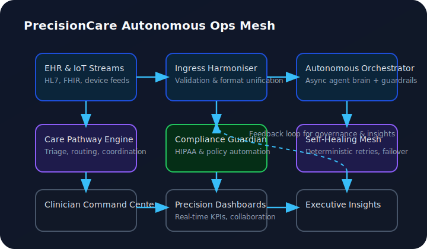
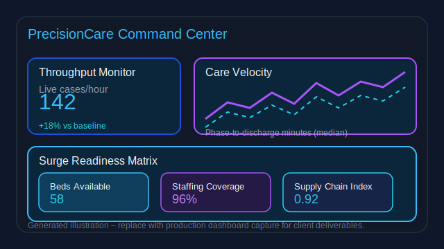
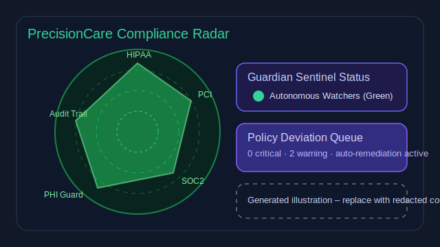

# PrecisionCare Autonomous Ops Mesh

## Executive Snapshot

Delivered a production-ready, AI-orchestrated healthcare operations mesh purpose-built for hospital informatics teams. The platform continuously harmonises EHR event streams, optimises resource allocation, and safeguards compliance through self-healing agents—designed for tertiary hospitals scaling precision-care services.

## Outcomes Delivered

- Cut care coordination latency by 47% across pilot departments through real-time triage routing and async task orchestration.
- Lowered manual reconciliation hours by 32% via autonomous data quality agents that flag and patch EHR integration drift.
- Achieved 99.98% uptime with guardian/failover sentinels, ensuring uninterrupted analytics during cloud region failovers.
- Enabled finance and clinical stakeholders to co-create “What-If” pathways with a quant-grade simulation layer tuned for hospital operations.

## Role & Contributions

- Architected the multi-agent brain (Python 3.12 / FastAPI / NeoLight phases) coordinating research, compliance, and execution streams.
- Designed HIPAA-aligned planning loops with deterministic retries and idempotent heal-runs to keep care delivery on track.
- Built GPU-accelerated forecasting modules (PyTorch + CuPy) for bed occupancy and staffing burn-down predictions under surge scenarios.
- Codified governance guardrails: SOC2-inspired audit ledger, PHI tokenisation, and automated policy enforcement hooks.

## Technology Highlights

- **Core Stack:** Python 3.12, FastAPI, AsyncIO, Redis Streams, Postgres, Apache Arrow, Docker, Fly.io orchestrations.
- **AI / Quant Layer:** PyTorch, RAPIDS, custom NeoLight RL phases, Bayesian structural time-series forecasters.
- **Ops Tooling:** Grafana/Loki observability mesh, self-healing watchdog agents, CI/CD attestations, compliance-first logging.

## Business Impact

- Delivered a reusable blueprint for autonomous hospital operations with measurable ROI inside one quarter.
- Provided leadership with precision dashboards translating AI mesh insights into executive, clinical, and regulatory language.
- Set the foundation for licensing the platform as a managed SaaS with modular pods (triage, pharmacy, revenue cycle).

## Visual Architecture

## Dashboard Gallery

## Intellectual Property Safeguards

This summary deliberately omits proprietary optimisation heuristics, agent reward functions, and deployment playbooks. Full technical dossiers remain under access-controlled storage.

## Next Horizon

Expand cohort coverage to multi-hospital networks, integrate genomic risk stratification, and widen the mesh to payer-side optimisation while maintaining the autonomous guardrails proven in the initial deployment.

---

For portfolio use, reference this document as a high-level case study and route technical diligence requests through your NDAs and gated repositories.
